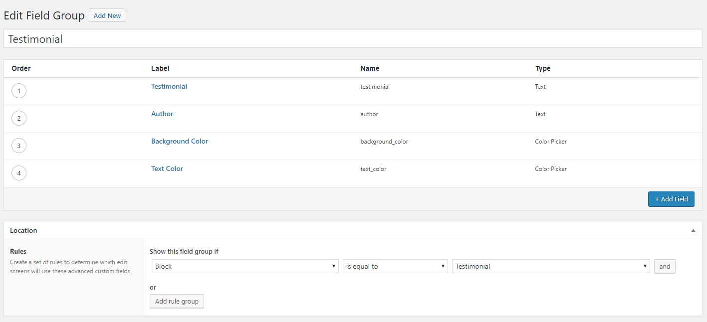

# Example Block Definitions for Register ACF Gutenberg Block

Example block definitions for use with https://github.com/mmirus/register-acf-gutenberg-block

For information on most of the possible block options, see:

- [`acf_register_block()` docs](https://www.advancedcustomfields.com/resources/acf_register_block/)
- [Gutenberg Block Registration docs](https://wordpress.org/gutenberg/handbook/designers-developers/developers/block-api/block-registration/)

These examples focus on how to render your block (particularly with Blade) and how to register its fields using [acf-builder](https://github.com/StoutLogic/acf-builder).

## Rendering Your Blocks

For simplicity, these demos all assume that the block's custom fields are being added elsewhere (e.g., via the ACF GUI). THere are examples of how to define the fields later in this document.

### Using a Blade template in a plugin

Note that currently the site must be using [Sage](https://roots.io/sage/) for Blade templates to work.

**Block definition**

`testimonial-block/testimonial-block.php`

```php
<?php
/*
Plugin Name: Testimonial Block Demo
*/

add_filter('mmirus/register-acf-gutenberg-block', function ($blocks, $block_defaults) {
    array_push($blocks, [
        'name'  => 'testimonial',
        'title' => 'Testimonial',
        'description' => 'Customer testimonial',
        'icon' => 'admin-comments',
        'keywords' => ['testimonial', 'quote'],
        'render_template' => plugin_dir_path(__FILE__) . '/views/testimonial-block.blade.php',
    ]);

    return $blocks;
}, 10, 2);
```

**Block template**

`testimonial-block/views/testimonial-block.blade.php`

```
<blockquote data-{{ $block['id'] }} class="{{ $block['classes'] }}">
  <p>{{ get_field('testimonial') }}</p>
  <cite>
    <span>{{ get_field('author') }}</span>
  </cite>
</blockquote>

<style type="text/css">
[data-{{$block['id']}}] {
  background: {{ get_field('background_color') }};
  color: {{ get_field('text_color') }};
}
</style>
```

### Using a PHP template in a plugin

**Block definition**

`testimonial-block/testimonial-block.php`

```php
<?php
/*
Plugin Name: Testimonial Block Demo
*/

add_filter('mmirus/register-acf-gutenberg-block', function ($blocks, $block_defaults) {
    array_push($blocks, [
        'name'  => 'testimonial',
        'title' => 'Testimonial',
        'description' => 'Customer testimonial',
        'icon' => 'admin-comments',
        'keywords' => ['testimonial', 'quote'],
        'render_template' => plugin_dir_path(__FILE__) . '/views/testimonial-block.php',
    ]);

    return $blocks;
}, 10, 2);
```

**Block template**

`testimonial-block/views/testimonial-block.php`

```php
<?php
// Set up the block data
$block['slug'] = str_replace('acf/', '', $block['name']);
$block['classes'] = implode(' ', [$block['slug'], $block['className'], $block['align']]);
?>

<blockquote data-<?= $block['id'] ?> class="<?= $block['classes'] ?>">
  <p><?= get_field('testimonial') ?></p>
  <cite>
    <span><?= get_field('author') ?></span>
  </cite>
</blockquote>

<style type="text/css">
[data-<?=$block['id']?>] {
  background: <?= get_field('background_color') ?>;
  color: <?= get_field('text_color') ?>;
}
</style>

```

### Using a Blade or PHP templates in your theme

The above code will also work for themes; you only have to adjust the template file paths, e.g.:

```php
// Blade template in Sage
'render_template' => get_template_directory() . '/views/blocks/testimonial-block.blade.php',

// PHP tempalte in theme
'render_template' => 'views/blocks/testimonial-block.php',
```

### Using a callback

**Block definition**

`testimonial-block/testimonial-block.php`

```php
<?php
/*
Plugin Name: Testimonial Block Demo
*/

add_filter('mmirus/register-acf-gutenberg-block', function ($blocks, $block_defaults) {
    array_push($blocks, [
        'name'  => 'testimonial',
        'title' => 'Testimonial',
        'description' => 'Customer testimonial',
        'icon' => 'admin-comments',
        'keywords' => ['testimonial', 'quote'],
        'render_callback' => 'testimonial_block_render_callback',
    ]);

    return $blocks;
}, 10, 2);

function testimonial_block_render_callback($block, $content = '', $is_preview = false)
{
    // Set up the block data
    $block['slug'] = str_replace('acf/', '', $block['name']);
    $block['classes'] = implode(' ', [$block['slug'], $block['className'], $block['align']]);
    ?>

    <blockquote data-<?= $block['id'] ?> class="<?= $block['classes'] ?>">
    <p><?= get_field('testimonial') ?></p>
    <cite>
        <span><?= get_field('author') ?></span>
    </cite>
    </blockquote>

    <style type="text/css">
    [data-<?=$block['id']?>] {
    background: <?= get_field('background_color') ?>;
    color: <?= get_field('text_color') ?>;
    }
    </style>
    <?php
}

```

## Registering Your Fields

### Using ACF Builder

**Install [acf-builder](https://github.com/StoutLogic/acf-builder):**

```
composer require stoutlogic/acf-builder
```

**Block definition**

`testimonial-block/testimonial-block.php`

```php
<?php
/*
Plugin Name: Testimonial Block Demo
*/

namespace TestimonialBlock;

use StoutLogic\AcfBuilder\FieldsBuilder;

require __DIR__ . '/vendor/autoload.php';

add_filter('mmirus/register-acf-gutenberg-block', function ($blocks, $block_defaults) {
    $fields = (new FieldsBuilder('testimonial'))
        ->addText('testimonial')
        ->addText('author')
        ->addColorPicker('background_color')
        ->addColorPicker('text_color')
        ->setLocation('block', '==', 'acf/testimonial')
        ->getRootContext()
        ->build();

    array_push($blocks, [
        'name'  => 'testimonial',
        'title' => 'Testimonial',
        'description' => 'Customer testimonial',
        'icon' => 'admin-comments',
        'keywords' => ['testimonial', 'quote'],
        'render_template' => plugin_dir_path(__FILE__) . '/views/testimonial-block.blade.php',
        'fields' => $fields,
    ]);

    return $blocks;
}, 10, 2);

```

**Block template**

`testimonial-block/views/testimonial-block.blade.php`

```
<blockquote data-{{ $block['id'] }} class="{{ $block['classes'] }}">
  <p>{{ get_field('testimonial') }}</p>
  <cite>
    <span>{{ get_field('author') }}</span>
  </cite>
</blockquote>

<style type="text/css">
[data-{{$block['id']}}] {
  background: {{ get_field('background_color') }};
  color: {{ get_field('text_color') }};
}
</style>
```

### Using the ACF GUI


